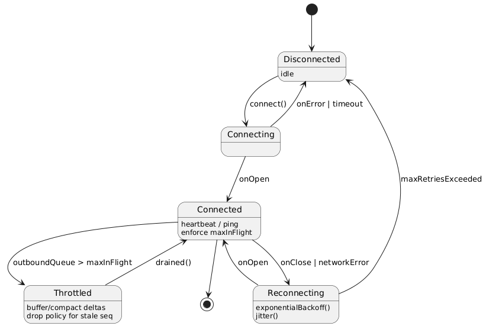

# 🚀 Advanced Trading Dashboard - Backend

A high-frequency trading (HFT) dashboard backend built with C++ and BinaryRPC framework, providing real-time market data, trade execution, and system monitoring capabilities.

## 🧭 Quick Navigation

| Section | Description |
|---------|-------------|
| [🚀 Quick Start Guide](#-quick-start---server-launch-guide) | **START HERE** - Get server running in 5 minutes |
| [🏗️ Architecture & System Design](#️-architecture--system-design) | UML diagrams and system architecture |
| [💻 Technology Stack](#-technology-stack--justification) | Technology choices and justifications |
| [📊 Real-Time Data Handling](#-real-time-data-handling) | WebSocket protocol and data flow |
| [🗄️ Database Integration](#️-database-integration) | ClickHouse integration and schema |
| [⚡ Performance Optimization](#-performance-optimization) | Performance bottlenecks and solutions |

---

## 📋 Project Overview

This project implements a real-time trading dashboard backend that meets the requirements for high-frequency trading with low latency and high performance demands. The system uses FPGA-based technology concepts and provides seamless integration with existing services while handling high volumes of data with minimal latency.

## 🏗️ Architecture & System Design

### UML Diagrams

The following diagrams illustrate the system architecture and design:

#### 1. Use Case Model

*Use case diagram showing trader interactions, React client, and ClickHouse integration*

#### 2. Class/Object Model

*Domain model showing entities, value objects, and service interfaces*

#### 3. Sequence Diagrams

*Authentication → Connect → Subscribe (room join + initial sync)*


*Order Place (QoS1 + idempotency + risk + rate-limit)*


*History Snapshot + Live Delta (initial snapshot → live stream)*


*RpcClient State Machine (retry, backoff, backpressure handling)*

#### 4. Component Architecture

*Subsystem Decomposition (Component View)*

#### 5. Deployment Architecture

*Hardware / Software Mapping (Deployment)*

#### 6. Database Schema

*Persistent Data Management (ClickHouse şeması)*

#### 7. Security Model

*Access Control & Security*

#### 8. System Lifecycle

*Boundary Conditions (Lifecycle & Alerts)*

#### 9. Service Interfaces

*Subsystem Services (Interfaces)*

## 💻 Technology Stack & Justification

### Backend Technologies

**C++20 with BinaryRPC Framework:**
- **Performance**: Native C++ provides microsecond-level latency required for HFT
- **BinaryRPC**: Custom RPC framework optimized for low-latency communication with MsgPack serialization
- **Memory Management**: RAII and smart pointers ensure predictable memory usage

**WebSocket Transport:**
- **Real-time Communication**: WebSocket with binary MsgPack protocol for minimal overhead
- **QoS Support**: AtLeastOnce delivery guarantee for critical operations like order placement

**ClickHouse Database:**
- **Time-Series Optimization**: Columnar storage optimized for time-series market data queries
- **High Performance**: Sub-second response times for historical data queries
- **Scalability**: Distributed architecture ready for high-volume data ingestion

### Key Features

- **Real-time Market Data**: Live tick streaming with room-based broadcasting
- **Order Management**: QoS1 guaranteed order placement with risk validation
- **Historical Data Access**: Efficient time-series queries with interval-based aggregation
- **System Monitoring**: Real-time metrics collection and alerting
- **Authentication**: JWT-based role-based access control (trader, viewer, admin)

## 🚀 Quick Start - Server Launch Guide

> **🎯 Want to see the server running quickly?** Follow these steps to get from zero to running server in 5 minutes!

### 📋 Prerequisites Check

Before starting, ensure you have these installed:

- ✅ **C++20 Compiler**: GCC 10+, Clang 12+, or MSVC 2019+
- ✅ **CMake**: Version 3.16 or higher  
- ✅ **Git**: For submodule management
- ✅ **Docker**: For ClickHouse (optional but recommended)

**Check your versions:**
```bash
gcc --version          # Should show 10.0+
cmake --version        # Should show 3.16+
git --version          # Any recent version
docker --version       # For ClickHouse setup
```

### 🏃‍♂️ Fast Setup (5 Minutes)

#### Step 1: Clone and Initialize
```bash
# Clone the repository with all submodules
git clone https://github.com/efecan0/Case-Real-Time-Trading-Dashboard trade-bull-backend
cd trade-bull-backend

# Initialize and update all submodules (this downloads BinaryRPC framework)
git submodule update --init --recursive
```
**⏱️ Expected time: 1-2 minutes**

#### Step 2: Bootstrap vcpkg Dependencies
```bash
# Navigate to vcpkg directory
cd third_party/vcpkg

# Bootstrap vcpkg (downloads and builds vcpkg executable)
# Linux/macOS:
./bootstrap-vcpkg.sh

# Windows:
.\bootstrap-vcpkg.bat

# Go back to project root
cd ../..
```
**⏱️ Expected time: 1-2 minutes**

#### Step 3: Configure and Build

**For Linux/macOS:**
```bash
# Use CMake presets for easy configuration
cmake --preset=development

# Build the project (this downloads and compiles all dependencies)
cmake --build --preset=build-development
```

**For Windows:**
```bash
# Use Windows-specific CMake presets with Visual Studio generator
cmake --preset=development-windows

# Build the project using MSBuild
cmake --build --preset=build-development-windows
```

**⏱️ Expected time: 3-5 minutes (depends on your machine)**

> **💡 Tip**: The first build takes longer as vcpkg downloads and compiles dependencies like ClickHouse client, nlohmann-json, etc.

#### Step 4: Start ClickHouse Database
```bash
# Start ClickHouse using Docker (recommended)
./setup_clickhouse.sh

# Alternative: Use docker-compose directly
docker-compose up -d clickhouse

# Verify ClickHouse is running
curl 'http://localhost:8123/' --data-binary 'SELECT 1'
# On Windows PowerShell, use:
# Invoke-WebRequest -Uri 'http://localhost:8123/' -Method POST -Body 'SELECT 1'
# Should return: 1
```
**⏱️ Expected time: 30 seconds**

#### Step 5: Launch the Trading Server! 🚀

**For Linux/macOS:**
```bash
# Navigate to build directory
cd build/RelWithDebInfo    # or Debug if you built in Debug mode

# Start the server
./bull-trading
```

**For Windows:**
```bash
# Navigate to Windows build directory
cd cmake-build-vs\RelWithDebInfo

# Start the server
.\bull-trading.exe
```

**🎉 Success Output:**
```
Starting advanced trading server on 0.0.0.0:8082
🚀 About to call app_->run() on port 8082...
✅ app_->run() completed - server started asynchronously
🔄 Server running... Press Ctrl+C to stop
[Trading Handshake] Starting authentication process...
[WebSocket] Transport configured - ping: 30s, maxMsgSize: 5MB
```

### 🔌 Server Verification

**Test if server is running:**
```bash
# Check if port 8082 is listening
netstat -an | grep 8082    # Linux/macOS
netstat -an | findstr 8082 # Windows

# Or test WebSocket connection (requires websocat tool)
websocat ws://localhost:8082
```

**Expected Server Features:**
- ✅ **WebSocket Server**: Running on port 8082
- ✅ **Authentication**: JWT-based login system
- ✅ **Market Data**: Real-time crypto market simulation
- ✅ **Order Management**: Place/cancel orders with risk validation
- ✅ **Historical Data**: ClickHouse integration for historical queries
- ✅ **System Metrics**: Real-time performance monitoring

### 🧪 Quick Test (Optional)

Run the test suite to verify everything works:
```bash
cd build
ctest --output-on-failure --verbose
```

### 🔧 Troubleshooting Common Issues

#### **Build Fails:**

**For Linux/macOS:**
```bash
# Clean and retry
rm -rf build/
cmake --preset=development
cmake --build --preset=build-development
```

**For Windows:**
```bash
# Clean and retry - remove Windows build directory
rmdir /s cmake-build-vs
cmake --preset=development-windows
cmake --build --preset=build-development-windows
```

#### **ClickHouse Connection Issues:**
```bash
# Check ClickHouse status
docker ps | grep clickhouse

# Restart ClickHouse
docker-compose restart clickhouse

# Check logs
docker-compose logs clickhouse
```

#### **Port Already in Use:**
```bash
# Find process using port 8082
lsof -i :8082     # Linux/macOS
netstat -ano | findstr :8082  # Windows

# Kill the process or change port in server configuration
```

#### **Permission Issues (Linux/macOS):**
```bash
# Make scripts executable
chmod +x setup_clickhouse.sh
chmod +x third_party/vcpkg/bootstrap-vcpkg.sh
```

### 📊 What You'll See When Running

Once the server starts, you should see:

1. **Server Initialization**:
   ```
   [Initialize] Creating ClickHouse repository...
   [Initialize] Tables created: SUCCESS
   [Initialize] Mock data generation result: SUCCESS
   ```

2. **Market Data Simulation**:
   ```
   [MarketSim] Broadcasting tick for BTC-USD: $47,250.50
   [MarketSim] Broadcasting tick for ETH-USD: $3,180.75
   ```

3. **Real-time Metrics**:
   ```
   [Metrics] Latency: 12.3ms, Throughput: 15.5 orders/sec, Active connections: 3
   ```

### 🎛️ Configuration Options

**Environment Variables** (set before running server):
```bash
export CLICKHOUSE_HOST=localhost
export CLICKHOUSE_PORT=9000
export CLICKHOUSE_HTTP_PORT=8123
export CLICKHOUSE_DATABASE=trading_db
```

**Server Configuration** (edit in source if needed):
- **Port**: `8082` (default)
- **Host**: `0.0.0.0` (accept all connections)
- **JWT Secret**: Configured in constructor

---

## 📚 Advanced Build Options

### Manual CMake Configuration (Alternative to presets)

**For Linux/macOS:**
```bash
mkdir build && cd build
cmake .. \
  -DCMAKE_TOOLCHAIN_FILE=../third_party/vcpkg/scripts/buildsystems/vcpkg.cmake \
  -DVCPKG_TARGET_TRIPLET=x64-linux \
  -DCMAKE_BUILD_TYPE=RelWithDebInfo
```

**For Windows:**
```bash
mkdir cmake-build-vs && cd cmake-build-vs
cmake .. \
  -DCMAKE_TOOLCHAIN_FILE=../third_party/vcpkg/scripts/buildsystems/vcpkg.cmake \
  -DVCPKG_TARGET_TRIPLET=x64-windows \
  -DCMAKE_BUILD_TYPE=RelWithDebInfo \
  -G "Visual Studio 17 2022" \
  -A x64
```

### Cross-Platform Build Commands
```bash
# Linux/macOS
make -j$(nproc)

# Windows (MSVC) - Use presets instead
cmake --build --preset=build-development-windows

# Cross-platform (with presets)
cmake --build --preset=build-development        # Linux/macOS
cmake --build --preset=build-development-windows # Windows
```

## 📊 Real-Time Data Handling

### WebSocket Implementation for Real-Time Updates

Our real-time dashboard updates are implemented using a **WebSocket + Room-based Architecture** with the following components:

#### **1. WebSocket Protocol & Connection Management**
```cpp
// WebSocket transport configured with MsgPack binary protocol
auto transport = std::make_unique<binaryrpc::WebSocketTransport>(sessionManager, 30, 5 * 1024 * 1024);
app_->setProtocol(std::make_unique<MsgPackProtocol>());

// QoS1 (AtLeastOnce) for reliable order delivery
binaryrpc::ReliableOptions opts;
opts.level = binaryrpc::QoSLevel::AtLeastOnce;
opts.baseRetryMs = 100; opts.maxRetry = 5;
transport->setReliable(opts);
```

**Key Features:**
- **Binary MsgPack Protocol**: Reduces payload size by ~30% compared to JSON
- **Keep-alive Mechanism**: 30-second ping interval for connection health
- **Authentication**: JWT token validation during handshake
- **Message Size Limit**: 5MB max per message for memory efficiency

#### **2. Room-Based Market Data Broadcasting**
```cpp
// Client subscription to market data rooms
void AdvancedTradingServer::handleMarketDataSubscribe(...) {
    // Clean existing subscriptions to prevent spam
    auto existingRooms = roomPlugin_->getRooms(sessionId);
    for (const auto& roomName : existingRooms) {
        roomPlugin_->leave(roomName, context.session().id());
    }
    
    // Join new symbol rooms
    for (const auto& symbol : symbols) {
        std::string roomName = getMarketDataRoom(symbol.get<std::string>());
        roomPlugin_->join(roomName, context.session().id());
    }
}

// Real-time data broadcasting to room subscribers
void AdvancedTradingServer::broadcastMarketData(const std::string& symbol, const nlohmann::json& data) {
    std::string roomName = getMarketDataRoom(symbol);
    std::string jsonStr = data.dump();
    std::vector<uint8_t> dataBytes(jsonStr.begin(), jsonStr.end());
    std::vector<uint8_t> serializedData = app_->getProtocol()->serialize("market_data", dataBytes);
    roomPlugin_->broadcast(roomName, serializedData);
}
```

**Architecture Benefits:**
- **Selective Broadcasting**: Only subscribers of specific symbols receive relevant data
- **Scalable Distribution**: Supports thousands of concurrent subscriptions
- **Memory Efficient**: Room management prevents unnecessary data copying

#### **3. Real-Time Data Flow Implementation**

**Market Data Simulation & Broadcasting:**
```cpp
void AdvancedTradingServer::simulateMarketData() {
    while (running_) {
        for (const auto& symbol : symbols) {
            // Generate realistic market tick data
            nlohmann::json tickData = {
                {"symbol", symbol},
                {"price", calculatePrice(symbol)},
                {"change", changePercent},
                {"volume", volume},
                {"seq", globalSequence++},        // Sequence for ordering
                {"timestamp", getCurrentTimeMs()}
            };
            
            // Broadcast to symbol-specific room
            broadcastMarketData(symbol, tickData);
        }
        std::this_thread::sleep_for(std::chrono::milliseconds(100));
    }
}
```

**Data Flow:**
1. **Client Connection**: WebSocket handshake with JWT authentication
2. **Room Subscription**: Client subscribes to market data rooms for specific symbols
3. **Initial Snapshot**: Historical data from ClickHouse served immediately
4. **Live Streaming**: Continuous tick updates (10 times/second) to subscribed rooms
5. **Order Processing**: Real-time order execution with immediate status updates

### State Synchronization & Data Consistency

#### **1. Session State Management**
```cpp
// Session-based state storage using BinaryRPC SessionManager
auto& sessionManager = app_->getSessionManager();

// Store user subscription state
sessionManager.setField(sessionId, "subscribedRooms", subscribedRooms, false);
sessionManager.setField(sessionId, "authenticated", "true", false);
sessionManager.setField(sessionId, "roles", rolesJson, false);

// Retrieve state across reconnections
auto authenticated = sessionManager.getField<std::string>(sessionId, "authenticated");
auto subscribedRooms = sessionManager.getField<std::vector<std::string>>(sessionId, "subscribedRooms");
```

**State Persistence Features:**
- **Cross-Connection Persistence**: State survives WebSocket reconnections
- **Role-Based Configuration**: Different access levels per user type
- **Subscription Memory**: Remembers user's market data subscriptions

#### **2. Data Consistency Mechanisms**

**Idempotency Guarantees:**
```cpp
// Order placement with idempotency key
std::string idempotencyKey = request.value("idempotencyKey", "");
if (idempotencyCache_->exists(idempotencyKey)) {
    // Return cached result for duplicate requests
    auto cachedResult = idempotencyCache_->get(idempotencyKey);
    return sendResponse(cachedResult);
}
```

**Sequence Numbering for Ordering:**
```cpp
// Global sequence for data ordering
static std::atomic<uint64_t> globalSequence{0};

// Each market tick includes sequence number
tickData["seq"] = globalSequence++;
tickData["timestamp"] = getCurrentTimeMs();
```

**Error Recovery & Reconnection:**
```cpp
// Automatic state restoration on reconnection
if (clientReconnected) {
    auto lastSubscriptions = sessionManager.getField<std::vector<std::string>>(sessionId, "subscribedRooms");
    if (lastSubscriptions) {
        // Automatically rejoin previous rooms
        for (const auto& room : *lastSubscriptions) {
            roomPlugin_->join(room, sessionId);
        }
    }
}
```

#### **3. Component State Synchronization**

**Dashboard Components Synchronize Through:**
1. **Unified WebSocket Connection**: Single connection serves all UI components
2. **Event-Driven Architecture**: Components subscribe to relevant data streams
3. **Centralized State Store**: Session state managed by BinaryRPC framework
4. **Atomic Updates**: Sequence numbers ensure proper data ordering
5. **Error Boundaries**: Failed updates don't corrupt other component states

**Real-Time Update Flow:**
```
Market Data Generator → Room Broadcasting → WebSocket → Client → State Update → UI Re-render
     ↓                        ↓              ↓          ↓          ↓            ↓
 Price Engine → Symbol Rooms → MsgPack → Client Hook → State Manager → Component
```

## 🗄️ Database Integration

### ClickHouse Schema Design & Implementation

Our historical trading data is efficiently stored using **ClickHouse** with the following optimized schema:

#### **1. Market Data Tables (Implemented)**

**`ticks` Table - Raw Market Data:**
```sql
CREATE TABLE IF NOT EXISTS trading_db.ticks (
    symbol String,
    ts DateTime64(6),
    bid Float64,
    ask Float64,
    last Float64,
    volume UInt64
) ENGINE = MergeTree()
ORDER BY (symbol, ts)
PARTITION BY toYYYYMMDD(ts)
TTL ts + INTERVAL 30 DAY
```

**`candles_1m` Table - Aggregated OHLCV Data:**
```sql
CREATE TABLE IF NOT EXISTS trading_db.candles_1m (
    symbol String,
    open_time DateTime,
    open Float64,
    high Float64,
    low Float64,
    close Float64,
    volume UInt64
) ENGINE = MergeTree()
ORDER BY (symbol, open_time)
PARTITION BY toYYYYMMDD(open_time)
TTL open_time + INTERVAL 180 DAY
```

**`orders_log` Table - Order Execution Audit:**
```sql
CREATE TABLE IF NOT EXISTS trading_db.orders_log (
    idemp_key String,
    ts DateTime,
    status String,
    order_id String,
    result String
) ENGINE = MergeTree()
ORDER BY (idemp_key, ts)
PARTITION BY toYYYYMMDD(ts)
```

#### **2. Query Performance Optimization Strategies**

**Partitioning for Efficient Queries:**
```cpp
// Implemented: Date-based partitioning for query pruning
PARTITION BY toYYYYMMDD(open_time)  // Daily partitions
ORDER BY (symbol, open_time)        // Optimized for time-range queries
```

**Optimized Query Implementation:**
```cpp
std::stringstream sql;
sql << "SELECT open_time, open, high, low, close, volume FROM " << database_ << ".candles_1m "
    << "WHERE symbol = '" << symbol.code << "' "
    << "AND open_time >= '" << fromBuffer << "' "
    << "AND open_time <= '" << toBuffer << "' "
    << "ORDER BY open_time DESC "
    << "LIMIT " << query.limit 
    << " FORMAT JSON";
```

**Performance Features:**
- **Sub-second Queries**: Optimized time-range queries with proper indexing
- **HTTP API**: Direct ClickHouse HTTP API for minimal overhead
- **Background Writer Thread**: Async data insertion to prevent blocking
- **Connection Pooling**: Thread-safe operations with mutex synchronization
- **Batch Processing**: Efficient bulk data operations for large datasets

#### **3. Large Dataset Handling**

**Memory-Efficient Operations:**
```cpp
// Thread-safe query execution
std::lock_guard<std::mutex> lock(client_mutex_);

// Background writer thread for non-blocking writes
std::thread writer_thread_;
std::queue<OrderLogData> log_queue_;
```

**TTL (Time To Live) Strategy:**
- **ticks**: 30-day retention for high-frequency raw data
- **candles_1m**: 180-day retention for aggregated data
- **Automatic cleanup**: Prevents storage bloat

## ⚡ Performance Optimization

### Identified Bottlenecks & Solutions

**Network Latency:**
- **Solution**: Binary MsgPack protocol, WebSocket keep-alive, connection pooling
- **Monitoring**: Real-time latency metrics with alerting

**Database Queries:**
- **Solution**: Query optimization, proper indexing, connection pooling
- **Caching**: In-memory caching for frequently accessed data

**Order Processing:**
- **Solution**: Lock-free data structures, async processing, QoS guarantees
- **Rate Limiting**: Prevents system overload during high-frequency trading

**Memory Usage:**
- **Solution**: RAII, smart pointers, buffer pooling
- **Monitoring**: Memory usage tracking and leak detection

### Monitoring & Alerts
- **Latency Tracking**: Per-operation latency measurement
- **Throughput Metrics**: Orders/second, connections, error rates
- **Alert Rules**: Configurable thresholds for system health

## 🔐 Security Considerations

### Authentication & Authorization
- **JWT Tokens**: Secure, stateless authentication
- **Role-Based Access**: trader, viewer, admin roles with different permissions
- **Session Management**: Secure session handling with automatic cleanup

### Data Protection
- **TLS/WSS**: Encrypted communication (configurable)
- **Input Validation**: Comprehensive request validation and sanitization
- **Rate Limiting**: Prevents abuse and DoS attacks

### Security Measures Implemented
1. **Token-based Authentication**: JWT verification in handshake inspector
2. **Role-based Authorization**: Method-level permission checking
3. **Rate Limiting**: Per-session operation limits
4. **Input Sanitization**: MsgPack payload validation
5. **Error Handling**: Secure error responses without information leakage

## 🚧 Potential Challenges & Solutions

### Technical Challenges

**1. Low-Latency Requirements**
- **Challenge**: Microsecond-level response times for order placement
- **Solution**: Compiled C++, binary protocol, lock-free programming, CPU affinity

**2. High-Frequency Data Processing**
- **Challenge**: Processing thousands of market ticks per second
- **Solution**: Async processing, connection pooling, batch operations

**3. System Reliability**
- **Challenge**: Zero downtime during market hours
- **Solution**: Health checks, automatic failover, graceful shutdown

**4. Data Consistency**
- **Challenge**: Ensuring order consistency across system restarts
- **Solution**: Idempotency keys, persistent logging, state recovery

### Scalability Considerations

**Horizontal Scaling:**
- Room-based architecture supports multiple server instances
- ClickHouse distributed setup for data scaling
- Load balancing at WebSocket connection level

**Vertical Scaling:**
- Multi-threaded processing with thread-safe operations
- Memory-mapped files for large dataset access
- CPU optimization with vectorized operations
